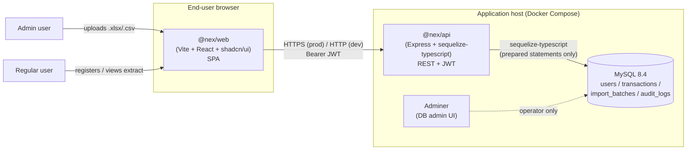

# C4 — Container diagram

System: **Nex Digital — full-stack transaction app**.

Mermaid renders this on GitHub directly.

### Containers

| Container | Tech | Responsibilities |
| --- | --- | --- |
| `@nex/web` | Vite + React 18 + Tailwind + shadcn/ui | Public auth pages; user extract & wallet; admin upload & report. Persists only the JWT in `localStorage`. |
| `@nex/api` | Node 20 + Express + sequelize-typescript | REST surface, auth, parsing, business rules, LGPD endpoints, audit log writes. |
| `MySQL 8.4` | mysql:8.4 | System of record. CPF stored encrypted (AES-256-GCM); password as bcrypt. |
| `Adminer` | adminer:4 | Local-only DB inspector. Not exposed in production. |

### Cross-cutting

- **Logs**: `pino` JSON to stdout; redaction enabled for `password`, `cpf`,
  `authorization`.
- **Secrets**: provided via `.env`; never committed.
- **Crypto envelope** (`LGPD_DATA_KEY`, `LGPD_HMAC_PEPPER`) injected into the
  API container, never exposed to the web container.
