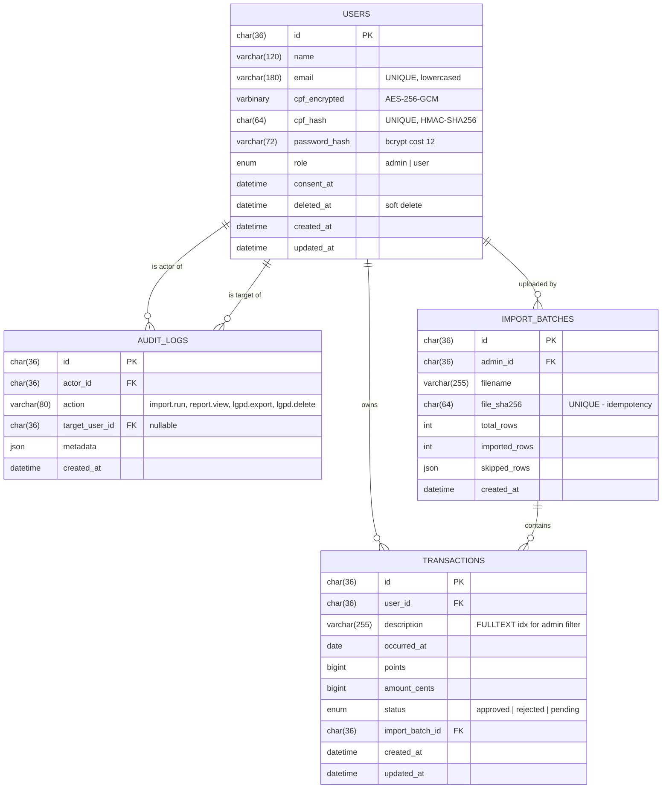

# Entity-relationship diagram

## Indices

| Table | Index | Purpose |
| --- | --- | --- |
| `users` | `(email)` UNIQUE | login |
| `users` | `(cpf_hash)` UNIQUE | spreadsheet lookup, registration uniqueness |
| `transactions` | `(user_id, status)` | wallet query |
| `transactions` | `(user_id, occurred_at)` | user extract |
| `transactions` | `(occurred_at, status, amount_cents)` | admin report filters |
| `transactions` | FULLTEXT `(description)` | admin "product" filter |
| `import_batches` | `(file_sha256)` UNIQUE | idempotent uploads |

## Conventions

- Primary keys are `CHAR(36)` storing UUID v4 generated server-side. Avoids
  enumeration attacks and keeps inserts roughly sequential when ordered by
  `created_at`.
- Money is stored as `BIGINT amount_cents` to avoid IEEE-754 drift.
- Points are stored as `BIGINT` — the spreadsheet uses `"10,000"` which the
  parser normalises to integer `10000`.
- `occurred_at` is `DATE` (not `DATETIME`) because the source spreadsheet
  carries no time component.
