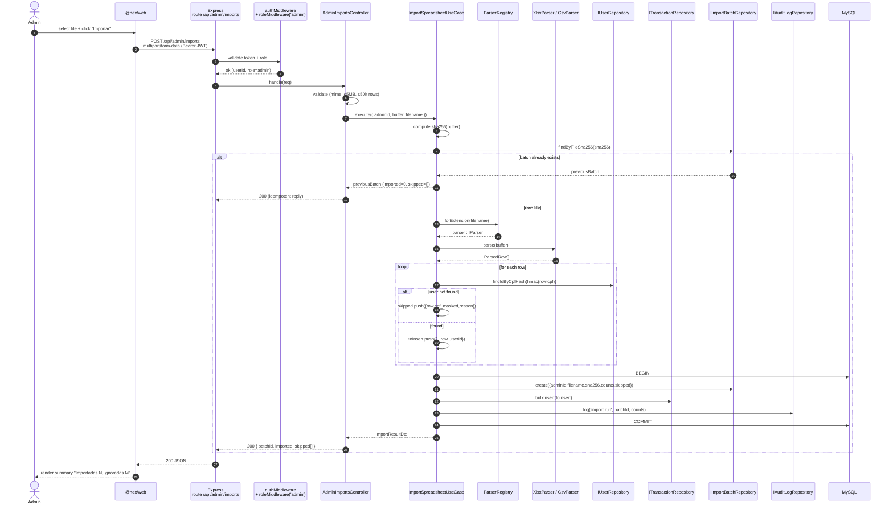

# Sequence — admin spreadsheet import

## Notes

- **Idempotency**: the file's SHA-256 is the deduplication key. Replaying the
  same upload returns the previous batch with `imported=0` and the same
  `skippedRows` payload — no double-spend of points.
- **Transactional**: between the BEGIN and COMMIT the use case writes the
  batch, transactions and audit row. A crash before COMMIT leaves the system
  in its previous state.
- **PII in logs**: only `cpf_masked` (`***.***.300-00`) is logged. The full
  CPF stays in memory just long enough to compute the HMAC.
- **Performance**: bulk insert is a single `INSERT INTO transactions VALUES
  (...), (...), ...` statement, sized to ~500 rows per batch by the
  repository to stay below `max_allowed_packet`.
